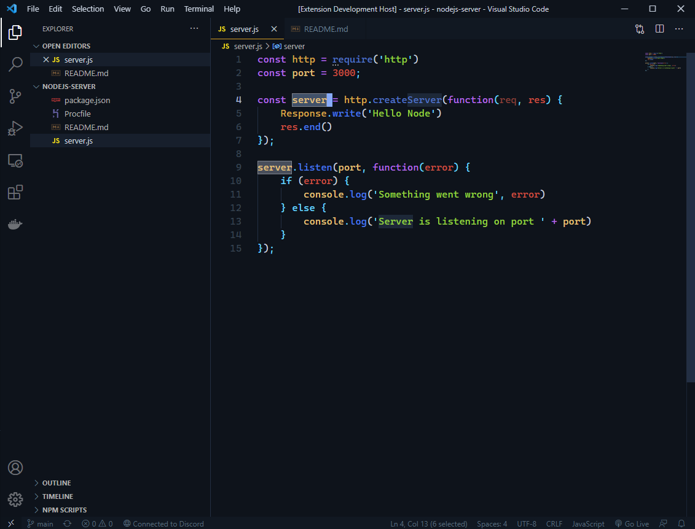
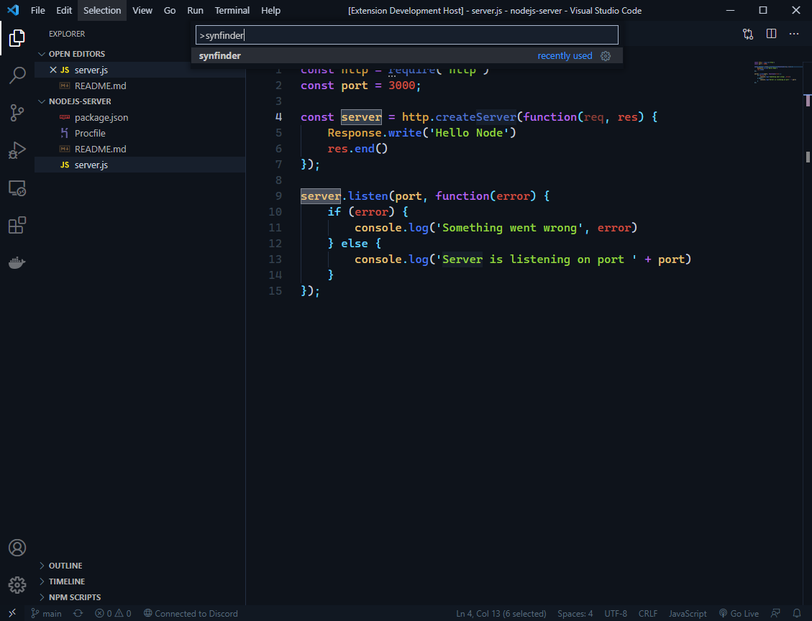
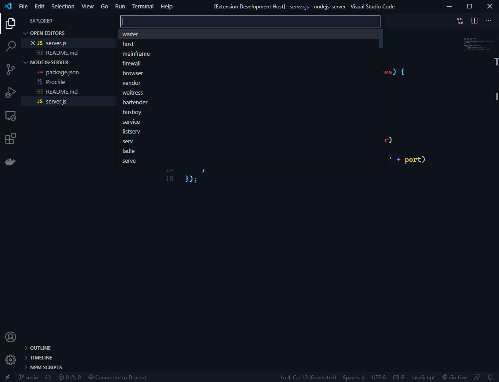
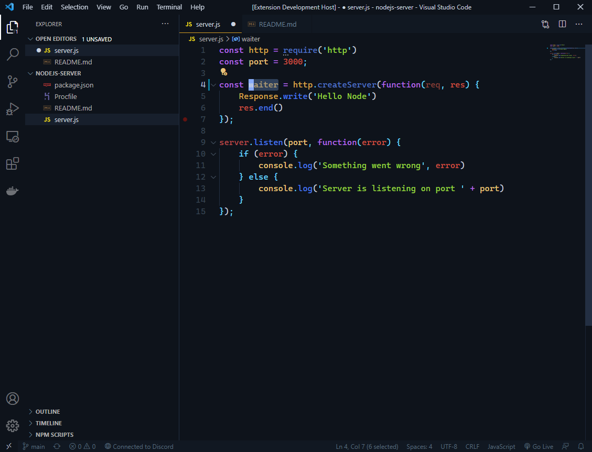

# SynFinder

This is an synonym finding extension for VSCode. The extension uses [Datamuse API](http://www.datamuse.com/api/) to find the synonyms. SynFinder is not very useful when writing code, but can help you to write good READMEs :)

## How to use

First, select the word or words you want to find the synonyms for:

Then open command palette (on Windows Ctrl+Shift+P, on MacOS Cmd+Shift+P) and search for synfinder:

Then execute synfinder command and you will get the synonyms:

Then select the synonym you want, press Enter and the word will be replaced to your selection:

